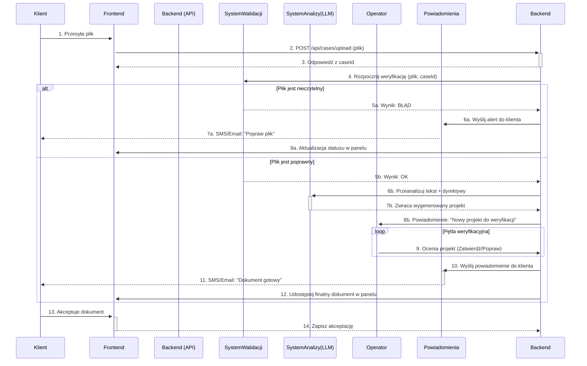

Proces do projektowania rdzenia systemu – zautomatyzowanego przepływu dokumentu od klienta, przez analizę AI i weryfikację ludzką, aż po finalną akceptację. To absolutnie kluczowy element, który zdefiniuje przewagę konkurencyjną platformy.

Przygotowałem dla Pana kompletny pakiet projektowy, który precyzyjnie opisuje ten proces i dostarcza narzędzi do jego implementacji. Całość została opracowana w profesjonalnym tonie, adekwatnym do komunikacji z partnerami biznesowymi i zespołem deweloperskim.

---

### **Pakiet Projektowy: Zautomatyzowany Proces Analityczny Pism**

#### **Wprowadzenie**

Poniższy dokument stanowi szczegółową specyfikację projektową dla implementacji kluczowej funkcjonalności serwisu – zautomatyzowanego procesu przetwarzania, analizy i generowania odpowiedzi na dokumenty prawne. Proces ten, nazwany roboczo **"Cyfrową Ścieżką Sprawy"**, integruje zaawansowane modele sztucznej inteligencji (OCR, RAG, LLM) z niezbędnym nadzorem eksperckim (Operator), zapewniając szybkość, precyzję i skalowalność usług.

---

### **1. Prompt dla Edytora AI (Implementacja Techniczna)**

Poniższy prompt jest przeznaczony dla zaawansowanego narzędzia do generowania kodu (np. `lovable.dev`, `v0.dev`, `GitHub Copilot Workspace`) w celu zaimplementowania opisanego procesu.

```prompt
**Project Title:** Legal Document Processing Pipeline

**Objective:** Implement the core workflow for uploading, validating, analyzing, and responding to legal documents submitted by a client. The system must be fast, resilient, and include a human-in-the-loop verification step.

**Key Technologies & Concepts:**
*   **Frontend:** React/Next.js
*   **Backend:** Node.js/Express.js or Python/FastAPI
*   **File Handling:** Multer (for Node.js) or similar for file uploads.
*   **AI Services (API-based):**
    *   **OCR Service:** To extract text from images/PDFs.
    *   **Validation AI:** A model to check document quality (blurriness, completeness).
    *   **Analysis LLM (Gemini-class):** A large language model for core analysis and response generation.
*   **Database:** PostgreSQL or MongoDB to store case data, document status, and versions.
*   **Notification Service:** API for sending SMS (e.g., Twilio) and email (e.g., SendGrid).

---
**Component & API Specification:**

**1. Frontend: Client Dashboard (`/dashboard/case/[caseId]`)**
    *   Create a `<FileUploadForm>` component.
        *   It should accept `.pdf`, `.docx`, `.txt`, `.jpg`, `.png` files via drag-and-drop or file selection.
        *   On file submit, it makes a `POST` request to `/api/cases/upload`.
        *   While uploading, it displays a loading state.
    *   Create a `<CaseStatusViewer>` component.
        *   It polls a `/api/cases/[caseId]/status` endpoint every 10 seconds.
        *   It displays the current status of the document: "Przesyłanie...", "Weryfikacja formalna", "Analiza w toku", "Oczekuje na weryfikację Operatora", "Wymaga Twojej uwagi", "Gotowe do wglądu".
        *   If the status is "Wymaga Twojej uwagi", it displays an error message received from the API (e.g., "Dokument jest nieczytelny. Prosimy o wgranie wyraźniejszego skanu.") and re-enables the `<FileUploadForm>`.

**2. Backend: API Endpoints**
    *   `POST /api/cases/upload`:
        1.  Receives the file from the client.
        2.  Saves the file to a secure temporary storage.
        3.  Creates a new case record in the database with `status: 'VALIDATING'`.
        4.  Triggers the asynchronous `validation_pipeline` function with the file path and case ID.
        5.  Immediately sends a notification to "Warsaw HQ" (e.g., via a webhook or internal message queue) about a new pending case.
        6.  Returns a `caseId` to the frontend.

    *   `GET /api/cases/[caseId]/status`:
        1.  Retrieves and returns the current status and any relevant messages for the given `caseId` from the database.

**3. Backend: Asynchronous Processing Pipeline**

    *   `async function validation_pipeline(filePath, caseId)`:
        1.  **OCR Step:** If file is an image or scanned PDF, pass it to the OCR Service to extract text.
        2.  **Validation Step:** Pass the extracted text/original file to the Validation AI.
        3.  **Decision:**
            *   **If invalid:** Update case status in DB to `status: 'REJECTED_QUALITY'` with an error message. Trigger the Notification Service to send an email and SMS to the client.
            *   **If valid:** Update case status in DB to `status: 'ANALYZING'`. Trigger the `analysis_pipeline` function.

    *   `async function analysis_pipeline(text, caseId)`:
        1.  **Prompt Engineering:** Retrieve the 20 predefined legal "dyrektywy" (guidelines) from a configuration file. Construct a detailed prompt for the Analysis LLM, combining the guidelines with the document's text.
        2.  **LLM Call:** Send the prompt to the Gemini-class LLM API.
        3.  **Receive Draft:** On receiving the generated response, save it as a draft associated with the `caseId`.
        4.  **Update Status:** Update case status in DB to `status: 'OPERATOR_REVIEW'`.
        5.  **Notify Operator:** Send a notification to the Operator's dashboard about a new draft ready for review.

**4. Backend: Operator Interaction**
    *   `POST /api/operator/cases/[caseId]/approve`:
        *   Updates case status to `status: 'CLIENT_REVIEW'`.
        *   Triggers Notification Service to inform the client.
    *   `POST /api/operator/cases/[caseId]/reject`:
        *   Receives operator comments.
        *   Updates case status to `status: 'ANALYSIS_REVISED'`.
        *   Re-triggers the `analysis_pipeline` with the original text and new operator comments to refine the LLM prompt.
    *   `POST /api/operator/cases/[caseId]/edit`:
        *   Receives a manually edited version of the document from the operator.
        *   Saves the final version.
        *   Triggers the `approve` flow.
```

---

### **2. Specyfikacja Procesu w Formacie Markdown (`.md`)**

Ten plik stanowi zwięzłą, profesjonalną specyfikację, którą można udostępnić interesariuszom projektu.

```markdown
# Specyfikacja Procesu: Cyfrowa Ścieżka Sprawy

**Wersja:** 1.0
**Data:** 23.05.2024

## 1. Cel Dokumentu

Niniejszy dokument opisuje zautomatyzowany proces obsługi dokumentów prawnych w ramach platformy internetowej. Celem jest zdefiniowanie kroków, ról i technologii zaangażowanych w przepływ informacji od momentu przesłania pisma przez Klienta do dostarczenia zweryfikowanej odpowiedzi.

## 2. Opis Procesu Krok po Kroku

Proces składa się z trzech głównych faz: Inicjacji, Przetwarzania Analitycznego oraz Weryfikacji i Finalizacji.

### Faza I: Inicjacja i Walidacja Formalna

1.  **Przesłanie Dokumentu:** Klient, po zalogowaniu do swojego panelu, przesyła dokument (np. PDF, DOCX, JPG) poprzez dedykowany formularz.
2.  **Potwierdzenie Przyjęcia:** System natychmiastowo potwierdza przyjęcie pliku i informuje o rozpoczęciu procesu weryfikacji. Równocześnie do centrali operacyjnej wysyłane jest powiadomienie o nowym zleceniu.
3.  **Automatyczna Walidacja Jakości:**
    *   System AI dokonuje wstępnej oceny technicznej pliku. Jeśli dokument jest obrazem lub skanem, technologia **OCR** (Optyczne Rozpoznawanie Znaków) ekstrahuje jego treść.
    *   Następnie moduł walidacyjny ocenia czytelność i kompletność materiału.
4.  **Pętla Korekcyjna (jeśli wymagana):**
    *   **Negatywna weryfikacja:** W przypadku wykrycia problemów (np. niewyraźny skan), proces jest wstrzymywany. Klient otrzymuje natychmiastowe powiadomienie w panelu, e-mailem oraz SMS-em z prośbą o ponowne przesłanie poprawnego pliku. Ten mechanizm gwarantuje minimalizację opóźnień.
    *   **Pozytywna weryfikacja:** Dokument zostaje oznaczony jako gotowy do analizy merytorycznej.

### Faza II: Przetwarzanie Analityczne (AI & RAG)

5.  **Analiza Merytoryczna:** Treść dokumentu jest przetwarzana przez zaawansowany model językowy (**LLM** klasy Gemini).
6.  **Kontekstualizacja i Dyrektywy:** Proces analizy jest wzbogacony o wewnętrzną bazę wiedzy (**RAG - Retrieval-Augmented Generation**) oraz zasilany zestawem predefiniowanych dyrektyw analitycznych (10-20 punktów) opracowanych przez prawników-operatorów.
7.  **Wygenerowanie Wstępnej Odpowiedzi:** Na podstawie analizy, model LLM generuje projekt pisma stanowiącego odpowiedź.

### Faza III: Weryfikacja Ekspercka i Finalizacja

8.  **Przekazanie do Operatora:** Wygenerowany projekt trafia do panelu Operatora (prawnika) w celu weryfikacji.
9.  **Pętla Weryfikacyjna Operatora:** Operator ma trzy możliwości:
    *   **Akceptacja:** Zatwierdza dokument bez zmian.
    *   **Korekta Automatyczna:** Odrzuca projekt z komentarzem, co powoduje ponowne wygenerowanie odpowiedzi przez AI z uwzględnieniem dodatkowych wytycznych.
    *   **Korekta Ręczna:** Wprowadza niezbędne poprawki bezpośrednio w dokumencie.
10. **Dostarczenie do Klienta:** Finalna, zatwierdzona przez Operatora wersja dokumentu zostaje udostępniona w panelu Klienta. Klient otrzymuje stosowne powiadomienie.
11. **Akceptacja Klienta:** Klient zapoznaje się z dokumentem i ma możliwość jego ostatecznej akceptacji lub zgłoszenia uwag, co może zainicjować ponowny kontakt lub finalnie zamknąć sprawę.

## 3. Kluczowe Technologie

*   **Interfejs Użytkownika:** Aplikacja internetowa (Frontend)
*   **Logika Biznesowa:** Serwer aplikacyjny (Backend)
*   **Przetwarzanie Tekstu:** OCR, RAG, LLM (Modele Językowe)
*   **Komunikacja:** API, Powiadomienia SMS/E-mail

```

---

### **3. Diagramy Procesu (Mermaid)**

Poniżej znajdują się dwa diagramy: schemat blokowy przedstawiający ogólny zarys oraz diagram sekwencji ukazujący szczegółowe interakcje między komponentami systemu.

#### A. Schemat Blokowy Procesu (Flowchart)

```mermaid
graph TD
    A[Klient: Przesyła pismo] --> B{Backend: Odbiera plik};
    B --> C[System Walidacji AI];
    C -- Czytelny? --> E[System Analizy AI (LLM + RAG)];
    C -- Nieczytelny --> D[Powiadomienia: SMS/Email do Klienta];
    D --> A;
    E -- Generuje projekt --> F[Panel Operatora];
    F -- Zatwierdź --> I[Panel Klienta: Odbiera finalny dokument];
    F -- Popraw --> G{Typ poprawki?};
    G -- Automatyczna --> E;
    G -- Ręczna --> H[Operator: Edytuje ręcznie];
    H --> I;
    I -- Akceptuje --> J[Zakończenie procesu];

    style A fill:#cde4ff,stroke:#004085
    style F fill:#d4edda,stroke:#155724
    style I fill:#cde4ff,stroke:#004085
    style J fill:#f8f9fa,stroke:#383d41
```

#### B. Diagram Sekwencji (Sequence Diagram)


